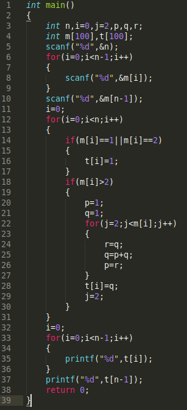
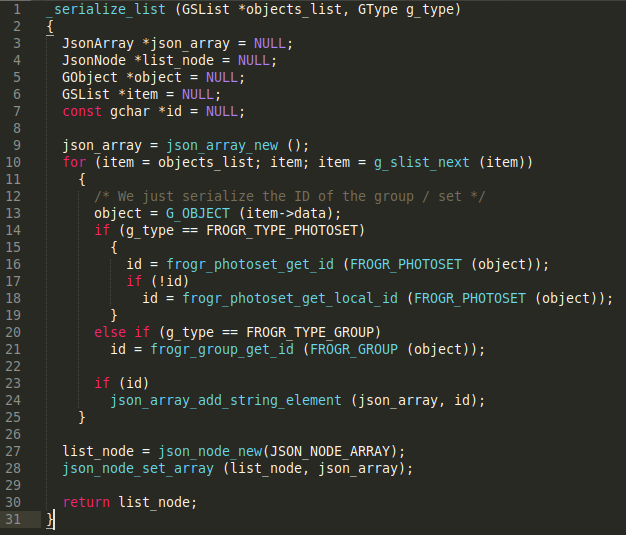

# Experiment 3-AST Neural Network (Replication & Application)

This repo is for the replication and application of ASTNN to represent source code for a software vulnerability detection task.

## Abstract Syntax Tree Neural Network
* Developed and implemented by Zhang et. al (2019) [A Novel Neural Source Code Representation based on Abstract Syntax Tree](https://2019.icse-conferences.org/details/icse-2019-Technical-Papers/2/A-Novel-Neural-Source-Code-Representation-based-on-Abstract-Syntax-Tree)
* Their repository is: https://github.com/zhangj111/astnn
* They presented the work in ICSE 2019.
* Acquired good results for source code classification and code clone detection.
* The code clone detection works for all types of clones (Type 1  - 4 )
* No known implementation of the proposed source code representation method for software vulnerability detection.
* This is an exploratory application experiment

## Datasets

Code clone detection (C and Java):

OJ Dataset (OJClone):
* They have 104 different programming problems.  
* Program is known to be clone if it trying to solve the same programmingg problem. 
* Each programming problem has around 500 programs. Too many. So they only select the first 15 programming problems to produce clone pairs.
* Then randomly selects 50000 programs.

Big Code Bench (BCB)

Source code classification (C only):
1. `Open Judge`

Software vulnerability detection:
1. Will upload later

## Replication

#### Code Clone Detection

Random seed for data splitting: 666   
Total testing results for OJ Clone dataset (C):

* Precision: 0.984
* Recall: 0.948
* F1-Measure: 0.966

Total testing results for Big Code Bench dataset (Java):

|Type   |Precision   |Recall   |F1   |
|---|---|---|---|
|Type 1   |99.84   |1.0   |99.92   |
|Type 2   |99.86   |1.0   |99.93  |
|Type 3-Strong  |99.80   |94.22   |96.93   |
|Type 3-Moderate  |99.70   |91.49   |95.42   |
|Type 4  |99.77   |88.32   |93.70   |
|**All**  |99.80   |88.40   |93.80   |

The results obtained from the replication is the same as reported in the paper.
This is because of the pretrained weights embeddings.

#### Source Code Classification

The results for training and testing:

The results obtained from the replication is the same as reported in the paper.
This is because of the pretrained weights embeddings.

## Application

* A possible way to apply ASTNN into vulnerability detection is by recreate the ASTNN creation process in our own implementation.
* This can be achieved by deconstructing the `pipeline.py` file that provides the pre-processing of the source code.
* However, `pycparser` cannot be used to parse the C/C++ source codes. Therefore, we decided to use `CodeSensor` from Fabian Yamaguchi's work here (https://github.com/fabsx00/codesensor). It's a custom fuzzy parser based on Antlrv3.
* Since the CodeSensor parser will produce an AST and the output of the `pycparser` is also an AST, there might be a chance to get the former to work. Definitely the structure will be quite different. Will look into it further. 
* Please read `Exploration_codeclassify.ipynb` for more information on how the source codes is transformed to become the final structure mentioned in the paper.

## Problems

* The work implements `pycparser` as their parser to create AST from the source code. However, pycparser requires heavu customization to parse **real world source codes** from real open source applications. The implementation uses `pycparser` with Open Judge (OJ) dataset which is a clean code source. There are no external libraries or typedefs used in the OJ dataset. Therefore, parsing OJ dataset is a breeze. 
* Implementation through other dataset? Most datasets in vulnerability detectio is based on open source application codes. Therefore, the complexity will be the same with the dataset provided by Russell et .al (2018)

* Check the comparison below:

#### Open Judge dataset sample

#### Draper VDisc Dataset - Real-world open source software source codes from Russell et. al (2018)

