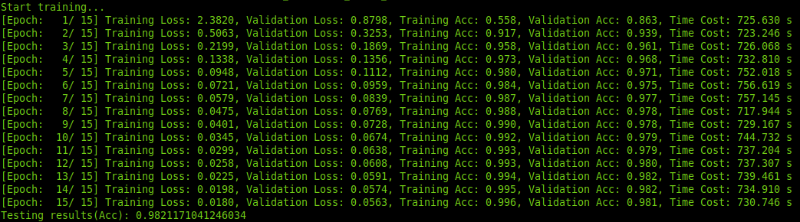

# Experiment 3-AST Neural Network (Replication & Application)

This repo is for the replication and application of ASTNN to represent source code for a software vulnerability detection task.

## Abstract Syntax Tree Neural Network
* Developed and implemented by Zhang et. al (2019) [A Novel Neural Source Code Representation based on Abstract Syntax Tree](https://2019.icse-conferences.org/details/icse-2019-Technical-Papers/2/A-Novel-Neural-Source-Code-Representation-based-on-Abstract-Syntax-Tree)
* Their repository is: https://github.com/zhangj111/astnn
* They presented the work in ICSE 2019.
* Acquired good results for source code classification and code clone detection.
* The code clone detection works for all types of clones (Type 1  - 4 )
* No known implementation of the proposed source code representation method for software vulnerability detection.
* This is an exploratory application experiment

## Datasets
Code clone detection (C and Java):
1. `Open Judge Clone (OJClone)`
2. `Big Code Bench (BCB)` 

Source code classification (C only):
1. `Open Judge`

Software vulnerability detection:
1. Will upload later

## Replication

#### Code Clone Detection

Total testing results for OJ Clone dataset (C):

* Precision: 0.984
* Recall: 0.948
* F1-Measure: 0.966

Total testing results for Big Code Bench dataset (Java):

|Type   |Precision   |Recall   |F1   |
|---|---|---|---|
|Type 1   |99.84   |1.0   |99.92   |
|Type 2   |99.86   |1.0   |99.93  |
|Type 3-Strong  |99.80   |94.22   |96.93   |
|Type 3-Moderate  |99.70   |91.49   |95.42   |
|Type 4  |99.77   |88.32   |93.70   |
|**All**  |99.80   |88.40   |93.80   |

The results obtained from the replication is the same as reported in the paper.
This is because of the pretrained weights embeddings.

#### Source Code Classification

The results for training and testing:

The results obtained from the replication is the same as reported in the paper.
This is because of the pretrained weights embeddings.

## Application

Lorem ipsum decolor sit amet.

