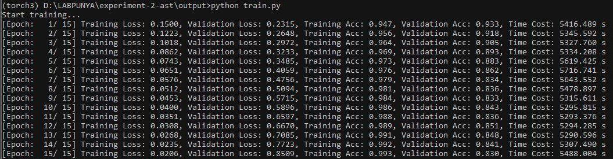

# Experiment 3-AST Neural Network (Replication & Application)

This repo is for the replication and application of ASTNN to represent source code for a software vulnerability detection task.

## Abstract Syntax Tree Neural Network
* Developed and implemented by Zhang et. al (2019) [A Novel Neural Source Code Representation based on Abstract Syntax Tree](https://2019.icse-conferences.org/details/icse-2019-Technical-Papers/2/A-Novel-Neural-Source-Code-Representation-based-on-Abstract-Syntax-Tree)
* Their repository is: https://github.com/zhangj111/astnn
* They presented the work in ICSE 2019.
* Acquired good results for source code classification and code clone detection.
* The code clone detection works for all types of clones (Type 1  - 4 )
* No known implementation of the proposed source code representation method for software vulnerability detection.
* This is an exploratory application experiment

## Datasets

Code clone detection (C and Java):

OJ Dataset (OJClone):
* They have 104 different programming problems.  
* Program is known to be clone if it trying to solve the same programmingg problem. 
* Each programming problem has around 500 programs. Too many. So they only select the first 15 programming problems to produce clone pairs.
* Then randomly selects 50000 programs.

Big Code Bench (BCB)

Source code classification (C only):
1. `Open Judge`

Software vulnerability detection:
1. VDiscovery from Russell et. al (2018) https://arxiv.org/abs/1807.04320
1. Original dataset can be downloaded from here https://osf.io/d45bw/
## Replication

#### Code Clone Detection

Random seed for data splitting: 666   
Total testing results for OJ Clone dataset (C):

* Precision: 0.984
* Recall: 0.948
* F1-Measure: 0.966

Total testing results for Big Code Bench dataset (Java):

|Type   |Precision   |Recall   |F1   |
|---|---|---|---|
|Type 1   |99.84   |1.0   |99.92   |
|Type 2   |99.86   |1.0   |99.93  |
|Type 3-Strong  |99.80   |94.22   |96.93   |
|Type 3-Moderate  |99.70   |91.49   |95.42   |
|Type 4  |99.77   |88.32   |93.70   |
|**All**  |99.80   |88.40   |93.80   |

The results obtained from the replication is the same as reported in the paper.
This is because of the pretrained weights embeddings.

#### Source Code Classification

The results for training and testing:

The results obtained from the replication is the same as reported in the paper.
This is because of the pretrained weights embeddings.

## Application

* A possible way to apply ASTNN into vulnerability detection is by recreate the ASTNN creation process in our own implementation.
* This can be achieved by deconstructing the `pipeline.py` file that provides the pre-processing of the source code.
* However, `pycparser` cannot be used to parse the C/C++ source codes. Therefore, we decided to use `CodeSensor` from Fabian Yamaguchi's work here (https://github.com/fabsx00/codesensor). It's a custom fuzzy parser based on Antlrv3.
* Since the CodeSensor parser will produce an AST and the output of the `pycparser` is also an AST, there might be a chance to get the former to work. Definitely the structure will be quite different. Will look into it further. 
* Please read `Exploration_codeclassify.ipynb` for more information on how the source codes is transformed to become the final structure mentioned in the paper.

## Problems

* The work implements `pycparser` as their parser to create AST from the source code. However, pycparser requires heavu customization to parse **real world source codes** from real open source applications. The implementation uses `pycparser` with Open Judge (OJ) dataset which is a clean code source. There are no external libraries or typedefs used in the OJ dataset. Therefore, parsing OJ dataset is a breeze. 
* Implementation through other dataset? Most datasets in vulnerability detection is based on open source application codes. Therefore, the complexity will be the same with the dataset provided by Russell et .al (2018)

* Check the comparison below:

#### Open Judge dataset sample

#### Draper VDisc Dataset - Real-world open source software source codes from Russell et. al (2018)

## Solving the problems

#### Parser
* We implemented the [CodeSensor](https://github.com/fabsx00/codesensor) from Fabian Yamaguchi which he implemented in [Yamaguchi et. al. (2012)](https://dl.acm.org/citation.cfm?id=2421003).
* To get the same output structure as in the ASTNN paper, we have to modify the output of CodeSensor to meet the criteria. Specifically, we define two structures:
	* `CodeSensor-Complete` (by Sergio). Full AST without any node replacement or removal
	* `CodeSensor-Minimal` (by Hazim). Minimal AST to try and follow the minimal structure of ASTNN.
* Please refer to https://gitlab.doc.ic.ac.uk/mhm1718/experiment-2-ast regarding the two modified parsers.
* After some pre-processing, we able to get two sets of data based on both modified parsers.
* The size of dataset is huge due to the complex nested structure of the AST:
	* `CodeSensor-Complete` is 2.13GB 
	* `CodeSensor-Minimal` is 437.5MB

#### Model training

* The `CodeSensor-Complete` training session:
	* GTX Titan XP from Imperial Slurm GPU cluster (12GB memory)
	* CPU 24-core/48 thread Intel Xeon with 256GB RAM
	* Pytorch 1.0.0 (CuDNN v10.0)
	* Training time ~37 hours per epoch (Total ~111 hours for 3 epochs)
	* Early stopping because Slurm cluster 7-day limit per job and validation loss increasing steadily thus further training is no longer required.
	* 
* The `CodeSensor-Minimal` training session:
	* RTX 2080 GPU (8GB memory)
	* CPU i7-8700K (32 GB RAM) system.
	* Pytorch 1.0.0 (CuDNN v10.0)
	* Training time ~90 minutes per epoch (Total ~23 hours for 15 epochs)
	* 

#### Model evaluation

* The `CodeSensor-Complete` model used is from the 1st epoch (the lowest validation loss)
* The `CodeSensor-Minimal` model used is from the 1st epoch (lowest validation loss)
 
| Reference|TP|FP|TN|FN|Acc|Precision|Recall|PR-AUC|AUC|MCC|F1|
|---	|---	|---	|---	|---	|---	|---	|---	|---	|---	|---	|---	|
|  Russel et.al (2018)	|  BL 	|  BL  	| BL  	|BL| BL  	|  BL 	| BL 	| **0.467**| **0.897**|**0.509**| **0.540**|
|  Replication 4th model	|  5093 	|  8666  	| 110500  	|3160| 0.9071  	|  0.3701 	| 0.6171  	| 0.3665| 0.8830|0.4317| 0.4627|
|  ASTNN (CodeSensor-Complete)|  390 	|  3551  	| 113984  	|7806| 0.9097  	|  0.099 	| 0.0476  	| 0.0535| 0.4278|0.0246| 0.0643|
|  ASTNN (CodeSensor-Minimal)	|  1091 	|  14145  	| 93641  	|5267| 0.8299  	|  0.0717 	| 0.1716  	| 0.0520| 0.4760|0.0272| 0.1010|

#### Parser evaluation
* To make sure that the modified parser, `CodeSensor-Complete` is appropriately representing the AST, we tested the parser on the `OJ Dataset`.
* `OJ Dataset` is the originally used dataset reported in the ASTNN paper.
* Therefore, we are trying to replicate the results of the original experiment using our modified parser.
* Originally, there are 2 tasks that were evaluated in the ASTNN paper. We replicate the experiments and reported the results.
* Task 1 - Code clone classification:

|Parser|Precision|Recall|F1|
|---|---|---|---|
|Pycparser (original)|0.984|0.948|0.966|
|CodeSensor-Complete|0.963|0.851|0.903|

* Task 2 - Source clone classification:

#### Remarks
* ASTNN structure still **unable** to perform well on real world datasets (VDiscovery) from  Russell et. al (2018).
* The modified parser, `CodeSensor-Complete` works really well on the original dataset (OJ Dataset).
* In **Task 1** for parser evaluation, the precision reported  is lower than the one originally reported by the paper. This is due to difference in structure of the AST produced by both parsers. Our stand with `CodeSensor-Complete` is firm as it able to produce a full AST structure for real world application source codes. `Pycparser` only works well if you have a synthetic dataset because it requires external libraries/headers to successfully parse all the real world source codes.
* `CodeSensor-Complete` eliminates the requirements of these external headers and libraries to successfully extract the AST from C and C++ source codes. This shows that the modified parser is robust as compared to `Pycparser`.
* In **Task 2**, surprisingly the results of the replicating the experiment using our modified parser is quite similar. The results are slightly lower than the originally reported in the paper. For example, the `validation accuracy` difference is just **0.003** and the `validation loss` difference is **0.0132**.
* Therefore, this shows that the modified parser is doing its job in translating source codes into ASTs.
* At the same time, this indicates that the parser is not a major factor that affect the performance of doing classifications.
* We tested the modified parsers on 2 datasets, and 3 different tasks. While it works really well for the synthetic dataset (OJ Dataset), it peformed really bad in real world source codes (VDiscovery.
* As as a conclusion, we can safely verify that the proposed structure ASTNN from the paper is not working well for detecting software vulnerabilities on a real world source codes (VDiscovery). However, it does work well on detecting code clones and code patterns on a synthethic dataset (OJ Dataset).
